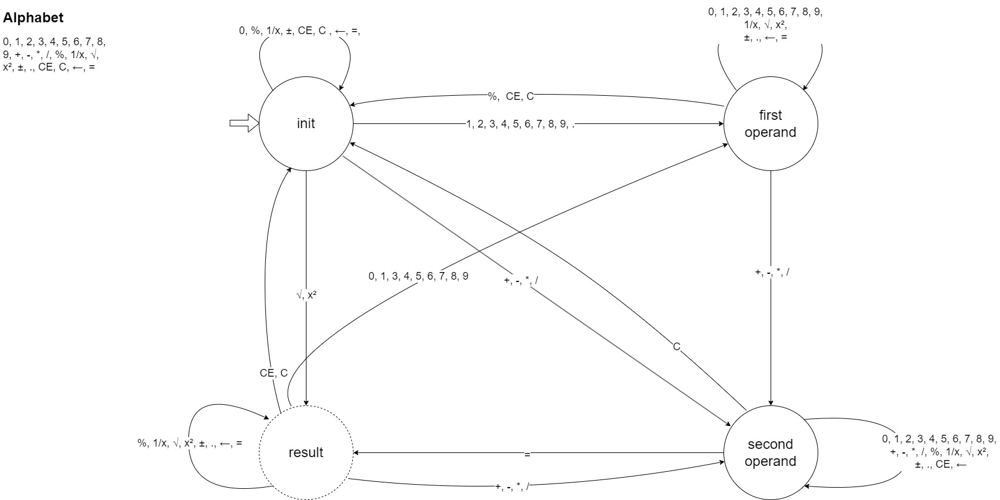

# .NET Calculator App

A simple calculator application built using Windows Forms (WinForms) in C#. It provides basic arithmetic operations and a user-friendly interface for performing calculations. The calculator's engine is implemented using a **Finite State Machine**.

## Features

1. **Basic Arithmetic Operations:**
   - Addition (+)
   - Subtraction (-)
   - Multiplication (*)
   - Division (/)

2. **User Interface:**
   - The calculator UI consists of buttons for digits, operators, and special functions.
   
3. **Event Handling:**
   - The application handles button clicks and performs the corresponding operations.
   - Events are wired up to update the display and handle user input.

## Contributing

Contributions are welcome! If you find any issues or have suggestions for improvements, feel free to create a pull request.

## License

This project is licensed under the MIT License - see the [LICENSE](LICENSE) file for details.